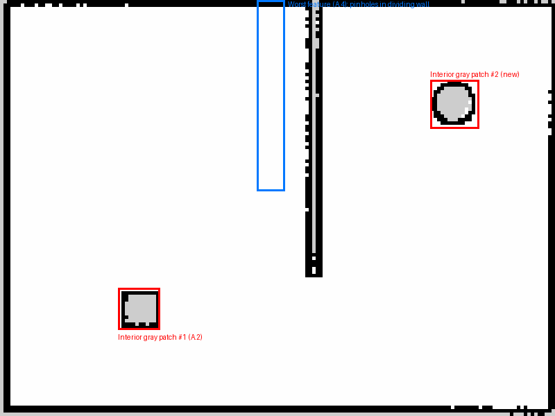

# Session 2 Homework — Part A

**Moses Maroun**

**Group PR link:** https://github.com/WaelSayegh/academy-bot-slam/pull/15

---

## A.1 — The Metadata

```bash
cat src/acadbot_navigation/maps/academy_map.yaml
head -2 src/acadbot_navigation/maps/academy_map.pgm | tail -1   # width height
```

**Output:**
```
image: academy_map.pgm
mode: trinary
resolution: 0.050
origin: [-1.011, -1.010, 0]
negate: 0
occupied_thresh: 0.65
free_thresh: 0.196

160 120
```

**Resolution:** `0.050` m/cell.

**Cell count and area:**
- Image is `160 × 120` cells → `160 × 120 = 19,200` cells total.
- Area: `(160 × 0.050 m) × (120 × 0.050 m) = 8 m × 6 m = 48 m²`.

**What `origin:` is measuring from:** `origin: [-1.011, -1.010, 0]` is the pose, in
the `map` frame, of the `.pgm`'s bottom-left pixel — not the middle of the room.
The `map` frame itself gets nailed down the instant `mapping.launch.py` starts,
at wherever the robot happened to be standing (and facing) at that moment. It
is not the room's geometric origin; it's a byproduct of where we launched from.
This is why the offset is a small, slightly-off-round number like `-1.011` and
not a clean `0` or `-1.0` — it's tied to an actual (imperfect) starting pose,
not a designed coordinate.

**Area versus the 8 m × 6 m room:** They land almost exactly on the nominal
`48 m²`. That only happens when two things both go right: the room is
axis-aligned in the map so nothing pads the bounding box from rotation, and
the exploration was complete enough that there's no large unresolved region
shrinking the useful footprint. This is our group's map, built after finishing
the loop, so both conditions hold.



---

## A.2 — Three States

Pixel-value histogram of `academy_map.pgm` (computed directly with `PIL`/`numpy`,
not eyeballed):

| Pixel value | Count | Meaning | How the robot came to know it |
|---|---|---|---|
| `0` (black) | 1,417 | **Occupied** | A LiDAR beam's endpoint landed on this cell, repeatably, across scans |
| `205` (gray) | 514 | **Unknown** | No LiDAR beam, from any pose we drove through, ever crossed this cell |
| `254` (white) | 17,269 | **Free** | A LiDAR beam passed through this cell on the way to hitting something further out, repeatably |

`1,417 + 514 + 17,269 = 19,200`, matching the cell count from A.1.

**An interior gray patch — not outside the walls:**


This is the circular object in the upper-right chamber: a clean black ring
where the LiDAR resolved its outer surface from several angles, and an
untouched gray disc dead center. That center cell is the sliver of floor
directly *behind* the object from every pose we drove past — no matter which
angle a beam approaches from, the object itself blocks it. That's occlusion,
not a coverage gap: driving one more lap wouldn't fix it unless we drove
*inside* the object, which isn't possible. It stays unknown because it is
structurally unobservable from any reachable pose, not because we didn't try.

---

## A.3 — What We Threw Away

**What we could still do with the pose graph that we can't do with the `.pgm`:**
Keep extending the map — drive further, add new scan nodes, and let new loop
closures re-correct the whole trajectory (including cells we already thought
were settled). The `.pgm` is a single frozen raster; once we saved it, that
correction machinery is gone.

**Why the `.pgm` is nevertheless the right thing to hand to a localiser:** A
localiser (AMCL) only ever compares one live scan against a fixed reference to
answer "where am I right now" — it never needs to edit the map. Handing it a
lightweight occupancy grid instead of the full pose graph means it loads fast
and has nothing to optimize; the expensive graph-correction step already
happened once, offline, when we built the map.

---

## A.4 — Grade Our Own Driving

Overall this is a clean map — no large unexplored regions, no rotation
inflating the room's footprint, area matching the real 8 m × 6 m room almost
exactly. The flaw that's actually there is the dividing wall between the two
chambers: it should be one solid black line, but it has a few thin white
pinhole gaps breaking it up.


Next to a fully solid wall elsewhere in the same map, gaps like this are what
you get from passing that wall at too shallow an angle or too far away on
every pass: the LiDAR's range/angle at that distance wasn't quite enough to
push every individual cell along the wall past `occupied_thresh` with full
confidence, so a handful of cells fell just short and stayed white instead of
turning black. The fix would have been a closer, more head-on pass specifically
along that dividing wall rather than trusting a single distant sweep to
resolve it.
